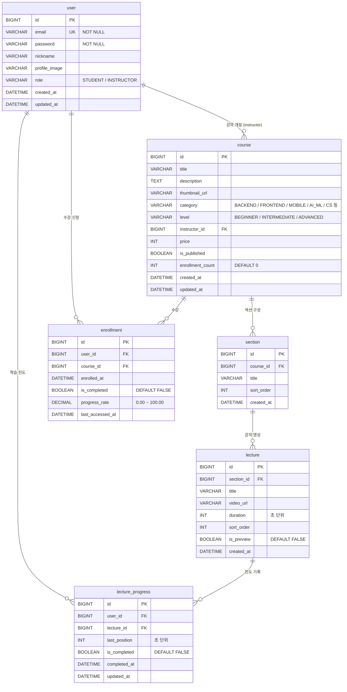

# LearnHub ERD (Entity Relationship Diagram)

## ERD 다이어그램

## 테이블 관계 설명

| 관계 | 설명 |
|------|------|
| user → course | 강사(instructor)가 강의를 개설 (1:N) |
| user → enrollment | 학생이 강의를 수강 신청 (1:N) |
| user → lecture_progress | 학생의 강의 영상별 학습 진도 (1:N) |
| course → section | 강의는 여러 섹션으로 구성 (1:N) |
| section → lecture | 섹션은 여러 강의 영상을 포함 (1:N) |
| course → enrollment | 강의에 여러 수강생 등록 (1:N) |
| lecture → lecture_progress | 영상별 진도 기록 (1:N) |

## 제약 조건

| 테이블 | 제약 | 설명 |
|--------|------|------|
| user | UNIQUE(email) | 이메일 중복 방지 |
| enrollment | UNIQUE(user_id, course_id) | 동일 강의 중복 수강 방지 |
| lecture_progress | UNIQUE(user_id, lecture_id) | 동일 영상 중복 진도 방지 |

## 시드 데이터 요약

| 테이블 | 건수 | 내용 |
|--------|------|------|
| user | 3 | 강사 2명 (김스프링, 이리액트), 학생 1명 (박학생) |
| course | 6 | Spring Boot, React, Vue.js, Algorithm, Docker+K8s, MySQL |
| section | 7 | 각 강의별 1~2개 섹션 |
| lecture | 20 | 각 섹션별 2~4개 영상 |
| enrollment | 2 | 박학생 → Spring Boot, React 수강 |
| lecture_progress | 3 | 일부 영상 시청 기록 |
