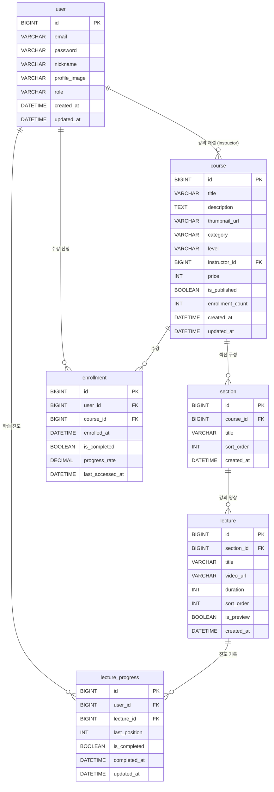

# LearnHub 프로젝트 문서

---

# 1. 프로젝트 기획서

## 1.1 프로젝트 개요

### 서비스명

**LearnHub (런허브)**

### 서비스 설명

개발자와 IT 전문가를 위한 온라인 강의 플랫폼으로, 실무 중심의 프로그래밍 강의를 제공합니다.
> P1 범위: 인증 없이 강의 탐색 / 수강 / 학습 진도 관리 핵심 플로우 구현 (인증은 P2에서 추가)

### 개발 배경

- 빠르게 변화하는 IT 기술 트렌드에 맞춰 학습자들이 최신 기술을 효율적으로 학습할 수 있는 환경 필요
- 강의 탐색부터 수강, 학습 진도 관리까지 원활한 사용자 경험 제공
- 인프런과 같은 검증된 플랫폼의 UX를 참고하여 직관적인 인터페이스 구현

### 프로젝트 목표

- 사용자 중심의 강의 플랫폼 MVP 구축
- 강의 탐색 → 상세 확인 → 수강 신청 → 학습 진행의 핵심 플로우 완성
- 반응형 디자인으로 모바일 / 데스크톱 모두 지원

---

## 1.2 주요 기능

### 강의 탐색

- 전체 강의 목록 조회
- 카테고리별 필터링 (웹 개발, 모바일, AI/ML, 데이터 사이언스 등)
- 검색 기능 (강의명, 강사명)
- 인기 강의 추천

### 강의 상세

- 강의 소개 및 커리큘럼 확인
- 섹션별 강의 목차 구조
- 강사 정보 및 수강평
- 수강 신청 버튼

### 학습 관리

- 내 강의실 (수강 중인 강의 목록)
- 영상 플레이어를 통한 강의 시청
- 학습 진도율 자동 저장
- 마지막 시청 위치 기억

### 사용자 관리

- 회원가입 / 로그인
- 마이페이지 (프로필, 수강 내역)
- 학습 대시보드

---

## 1.3 기대 효과

- 학습자: 체계적인 커리큘럼을 통한 효율적인 학습
- 강사: 강의 콘텐츠 공유 및 수익 창출 기회 제공
- 플랫폼: IT 교육 시장에서 경쟁력 있는 플랫폼 구축

---

# 2. 개발 계획서

## 2.1 기술 스택

### Frontend

- Framework: Next.js 16.2.1 (App Router)
- Styling: Tailwind CSS
- State Management: Zustand
- Video Player: React Player
- HTTP Client: Axios

### Backend

- Framework: Spring Boot 3.x
- Language: Java 17
- ORM: Spring Data JPA + Hibernate
- Build Tool: Gradle
- API 문서: Springdoc OpenAPI (Swagger UI)

### Database

- DBMS: MySQL 8.0
- Migration: Flyway
- Hosting: Local / AWS RDS (배포 시)

---

## 2.2 개발 일정 (2주)

### 1주차: 프로젝트 세팅 및 백엔드 구축

### Day 1-2: 프로젝트 초기 설정 및 DB 설계

- Spring Boot 프로젝트 생성 (Spring Initializr)
- Next.js 프로젝트 초기화 + Tailwind CSS 설정
- MySQL 데이터베이스 생성
- Flyway 마이그레이션 스크립트 작성
- ERD 최종 확정 및 테이블 생성
- docker-compose.yml 작성 (MySQL 로컬 환경)

### Day 3-5: 백엔드 API 개발

- 강의 C RUD API 구현 (Course, Lecture, Section)
- 수강 신청 API 구현 (Enrollment)
- 학습 진도 관리 API 구현 (LectureProgress)
- 사용자 프로필 API 구현 (User)
- Swagger UI 연동 및 API 문서화
- 예외 처리 표준화 (GlobalExceptionHandler)

### Day 6-7: 프론트엔드 기본 구조

- Axios 클라이언트 모듈 설정 (API base URL 등)
- 레이아웃 컴포넌트 구현
- 메인 페이지 UI
- 강의 목록 페이지 (백엔드 API 연동)
- 강의 상세 페이지 (백엔드 API 연동)

### 2주차: 기능 통합 및 완성

### Day 8-10: 핵심 기능 구현 및 연동

- 강의 검색 및 카테고리 필터링
- 수강 신청 로직 연동
- 비디오 플레이어 구현 (React Player)
- 학습 진도 저장 기능 연동
- 이어보기 기능 구현

### Day 11-12: 마이페이지 및 대시보드

- 내 강의실 페이지
- 학습 진도율 대시보드
- 프로필 조회/수정

### Day 13-14: QA 및 배포

- 전체 시나리오 테스트
- 반응형 디자인 점검
- 버그 수정 및 리팩토링
- Docker 이미지 빌드 (백엔드 + 프론트)
- EC2 / LightSail 배포
- 문서 정리 및 제출

---

## 2.3 개발 환경

### 프로젝트 구조

```
learnhub/
├── backend/                        # Spring Boot
│   ├── src/
│   │   ├── main/
│   │   │   ├── java/com/learnhub/
│   │   │   │   ├── course/
│   │   │   │   ├── enrollment/
│   │   │   │   ├── lecture/
│   │   │   │   ├── progress/
│   │   │   │   └── user/
│   │   │   └── resources/
│   │   │       ├── application.yml
│   │   │       └── db/migration/   # Flyway
│   │   └── test/
│   └── build.gradle
├── frontend/                       # Next.js
│   ├── src/
│   │   ├── app/
│   │   │   ├── courses/
│   │   │   ├── my-courses/
│   │   │   └── layout.tsx
│   │   ├── components/
│   │   ├── lib/
│   │   │   └── api/                # Axios 클라이언트
│   │   └── types/
│   ├── public/
│   ├── .env.local
│   └── package.json
└── docker-compose.yml
```

---

# 3. 요구사항 명세서

## 3.1 강의 탐색

| ID | 기능 | 상세 설명 | 우선순위 |
| --- | --- | --- | --- |
| F-01 | 강의 목록 조회 | 전체 강의 목록 조회 | 필수 |
| F-02 | 카테고리 필터 | 카테고리별 강의 필터링 | 필수 |
| F-03 | 강의 검색 | 강의명 또는 강사명 검색 | 필수 |
| F-04 | 인기 강의 추천 | 인기 강의 목록 표시 | 선택 |
| F-05 | 강의 상세 조회 | 강의 상세 정보 조회 | 필수 |

---

## 3.2 수강 관리

| ID | 기능 | 상세 설명 | 우선순위 |
| --- | --- | --- | --- |
| F-06 | 수강 신청 | 강의 수강 신청 | 필수 |
| F-07 | 내 강의실 | 수강 중 강의 목록 조회 | 필수 |
| F-08 | 수강 취소 | 수강 중 강의 취소 | 선택 |

---

## 3.3 학습 진행

| ID | 기능 | 상세 설명 | 우선순위 |
| --- | --- | --- | --- |
| F-09 | 영상 재생 | 강의 영상 시청 | 필수 |
| F-10 | 진도 자동 저장 | 시청 위치 자동 저장 | 필수 |
| F-11 | 이어보기 | 마지막 시청 위치부터 재생 | 필수 |
| F-12 | 진도율 계산 | 강의별 전체 진도율 계산 | 필수 |
| F-13 | 완강 처리 | 90% 이상 시청 시 완료 처리 | 선택 |

---

## 3.4 마이페이지

| ID | 기능 | 상세 설명 | 우선순위 |
| --- | --- | --- | --- |
| F-14 | 프로필 조회 | 사용자 정보 조회 | 필수 |
| F-15 | 프로필 수정 | 닉네임 및 이미지 수정 | 선택 |
| F-16 | 학습 대시보드 | 학습 통계 조회 | 선택 |

---

# 4. ERD (Entity Relationship Diagram)

## ERD 다이어그램



---

# 5. API 엔드포인트 명세서

## 5.1 강의 (Courses)

| 기능 | Method | Path | 설명 |
| --- | --- | --- | --- |
| 강의 목록 조회 | GET | /api/v1/courses | 전체 강의 목록 |
| 인기 강의 조회 | GET | /api/v1/courses/trending | 인기 강의 |
| 강의 상세 조회 | GET | /api/v1/courses/{courseId} | 강의 상세 정보 |

---

## 5.2 수강 신청 (Enrollments)

| 기능 | Method | Path | 설명 |
| --- | --- | --- | --- |
| 수강 신청 | POST | /api/v1/enrollments | 강의 수강 신청 |
| 내 강의실 조회 | GET | /api/v1/enrollments/my-courses | 수강 강의 목록 |
| 수강 취소 | DELETE | /api/v1/enrollments/{enrollmentId} | 수강 취소 |

---

## 5.3 강의 영상 (Lectures)

| 기능 | Method | Path | 설명 |
| --- | --- | --- | --- |
| 강의 영상 조회 | GET | /api/v1/lectures/{lectureId} | 영상 URL 조회 |

---

## 5.4 학습 진도 (Lecture Progress)

| 기능 | Method | Path | 설명 |
| --- | --- | --- | --- |
| 진도 저장 | PATCH | /api/v1/lectures/{lectureId}/progress | 영상 시청 위치 저장 |
| 강의 완료 처리 | POST | /api/v1/lectures/{lectureId}/complete | 영상 완료 처리 |
| 강의별 진도 조회 | GET | /api/v1/courses/{courseId}/progress | 강의 진도 조회 |

---

## 5.5 사용자 (Users)

| 기능 | Method | Path | 설명 |
| --- | --- | --- | --- |
| 프로필 조회 | GET | /api/v1/users/{userId} | 사용자 정보 조회 |
| 프로필 수정 | PATCH | /api/v1/users/{userId} | 프로필 수정 |
| 학습 대시보드 | GET | /api/v1/users/{userId}/dashboard | 학습 통계 조회 |