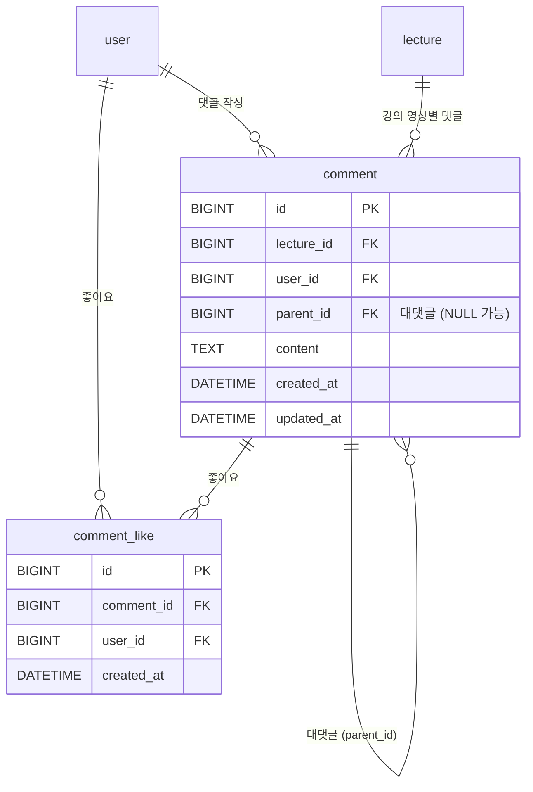

# LearnHub P2 프로젝트 문서

> P2 단계: 실전형 / 인증 + 권한 (JWT 인증, 역할 기반 접근 제어, 강사·학생 분리 운영)

---

# 1. 프로젝트 기획서

## 1.1 P2 개요

### 서비스명

**LearnHub (런허브) — P2: 인증 / 권한 / 운영**

### P2 단계 목표

P1에서 구축한 강의 탐색·수강·진도 관리 기능 위에 **사용자 인증·인가 시스템**과 **역할 기반 운영 기능**을 추가하여, 실제 서비스에 가까운 운영 형태로 발전시킨다.

- 익명 사용자가 아닌 **실제 가입 사용자** 기반 서비스로 전환
- **강사(INSTRUCTOR)** 와 **학생(STUDENT)** 역할 분리
- 강사는 본인 강의 등록·수정·관리, 학생은 수강·학습·소통
- 강의 영상별 **댓글 / 대댓글 / 좋아요** 기능으로 학습 커뮤니티 구축

### 개발 배경

- P1은 `userId=1` 하드코딩으로 동작 → 실제 사용자별 데이터 분리 불가
- 강의 등록/수정 권한이 없어 콘텐츠 관리 운영 불가
- 학습자 간 질문·답변 등 소통 채널 부재
- JWT 기반 표준 인증 구조를 직접 구현하여 보안 설계 역량 학습

### P2 핵심 가치

| 항목 | P1 | P2 |
| --- | --- | --- |
| 사용자 식별 | userId=1 고정 | JWT 토큰 기반 |
| 권한 | 없음 | STUDENT / INSTRUCTOR |
| 강의 관리 | 시드 데이터만 | 강사가 직접 등록·수정 |
| 학습 소통 | 없음 | 댓글 / 대댓글 / 좋아요 |
| 보안 | 없음 | 비밀번호 해싱, 토큰 검증, 권한 필터 |

---

## 1.2 주요 기능

### 인증 / 회원 관리

- 이메일 + 비밀번호 회원가입 (역할 선택: 학생 / 강사)
- 로그인 시 JWT Access Token 발급
- 로그인 상태 유지 (LocalStorage 기반)
- 로그아웃 (토큰 폐기)
- 내 정보 조회 / 프로필 수정

### 권한 기반 접근 제어 (RBAC)

- **공통**: 강의 탐색, 강의 상세 조회, 미리보기 영상 시청
- **STUDENT 전용**: 수강 신청, 학습 진도 저장, 댓글 작성, 좋아요
- **INSTRUCTOR 전용**: 강의 등록 / 수정 / 삭제, 본인 강의 수강생 통계 조회
- 권한 없는 접근 시 401 / 403 에러 반환

### 강사 운영 기능

- 강의 등록 (제목, 설명, 카테고리, 난이도, 썸네일)
- 섹션 / 강의 영상 관리
- 본인 강의 목록 조회
- 본인 강의 수강생 수 / 평균 진도 조회

### 학습 커뮤니티 (댓글 시스템)

- 강의 영상별 댓글 작성 / 조회 / 수정 / 삭제
- 대댓글 (1단계 depth) 지원
- 댓글 좋아요 / 좋아요 취소
- 본인 댓글만 수정·삭제 가능

---

## 1.3 P1 → P2 변경 / 추가 사항

| 영역 | P1 | P2 변경점 |
| --- | --- | --- |
| 사용자 인증 | 없음 | JWT 인증 추가, `Authorization: Bearer` 헤더 |
| 회원가입/로그인 | 없음 | `/api/v1/auth/signup`, `/api/v1/auth/login` 신규 |
| 강의 등록 | 시드 데이터 | 강사가 API로 직접 등록 |
| 수강 신청 | userId 파라미터 전달 | 토큰에서 사용자 식별 |
| 댓글 | 없음 | `comment`, `comment_like` 테이블 신규 |
| 보안 | 없음 | BCrypt 비밀번호 해싱, JWT 검증 필터 |

---

# 2. 개발 계획서

## 2.1 기술 스택 (P1 대비 추가)

### Backend (추가)

- Spring Security 6.x (인증 / 인가 필터 체인)
- jjwt 0.12.x (JWT 발급 / 검증)
- BCryptPasswordEncoder (비밀번호 해싱)

### Frontend (추가)

- 토큰 저장: LocalStorage + Axios Request Interceptor
- 인증 상태: Zustand auth store
- 보호 라우트: 미들웨어 / 클라이언트 가드

### Database (추가)

- `comment` 테이블 (강의 영상 댓글)
- `comment_like` 테이블 (댓글 좋아요)
- `user.password` 컬럼 BCrypt 해시값 저장

---

## 2.2 개발 일정 (3주)

### 1주차: 인증 시스템 구축

#### Day 1-2: Spring Security + JWT 기반 마련

- Spring Security 의존성 추가 및 SecurityConfig 작성
- JwtTokenProvider 구현 (생성 / 검증 / 클레임 파싱)
- JwtAuthenticationFilter 구현 (요청 헤더 → SecurityContext)
- BCryptPasswordEncoder 빈 등록

#### Day 3-4: 회원가입 / 로그인 API

- `POST /api/v1/auth/signup` 구현 (이메일 중복 체크, 비밀번호 해싱)
- `POST /api/v1/auth/login` 구현 (자격 검증, 토큰 발급)
- `GET /api/v1/auth/me` 구현 (토큰 → 사용자 정보)
- 예외 처리 표준화 (잘못된 자격, 만료 토큰, 권한 부족)

#### Day 5-7: 프론트 인증 화면 + 토큰 연동

- 회원가입 페이지 (`/signup`)
- 로그인 페이지 (`/login`)
- Axios Request Interceptor (자동 토큰 첨부)
- Axios Response Interceptor (401 → 로그인 페이지 리다이렉트)
- 인증 상태 Zustand store
- 헤더 UI (로그인 / 로그아웃 버튼)

---

### 2주차: 권한 분리 + 강사 운영 기능

#### Day 8-9: RBAC 적용

- `@PreAuthorize` 또는 SecurityConfig 경로별 권한 설정
- 기존 API 토큰 기반으로 사용자 식별 변경 (userId=1 제거)
- 권한 검증 단위 테스트

#### Day 10-12: 강사 강의 관리 API

- `POST /api/v1/courses` (강의 등록 — INSTRUCTOR)
- `PATCH /api/v1/courses/{courseId}` (강의 수정 — 본인만)
- `DELETE /api/v1/courses/{courseId}` (강의 삭제 — 본인만)
- `GET /api/v1/courses/me` (본인 개설 강의 목록)
- `POST /api/v1/courses/{courseId}/sections` (섹션 추가)
- `POST /api/v1/sections/{sectionId}/lectures` (강의 영상 추가)

#### Day 13-14: 강사 운영 화면

- 강사 대시보드 (`/instructor`)
- 강의 등록 폼
- 본인 강의 목록 / 수강생 수 / 평균 진도

---

### 3주차: 댓글 시스템 + 통합 / QA

#### Day 15-16: 댓글 백엔드

- `comment`, `comment_like` 테이블 마이그레이션 (V3)
- `POST /api/v1/lectures/{lectureId}/comments` (작성)
- `GET /api/v1/lectures/{lectureId}/comments` (목록 + 대댓글 트리)
- `PATCH /api/v1/comments/{commentId}` (수정 — 본인만)
- `DELETE /api/v1/comments/{commentId}` (삭제 — 본인만)
- `POST /api/v1/comments/{commentId}/like` (좋아요 추가)
- `DELETE /api/v1/comments/{commentId}/like` (좋아요 취소)

#### Day 17-18: 댓글 프론트

- 강의 시청 페이지 하단 댓글 영역
- 댓글 작성 폼 / 목록 / 대댓글 펼치기
- 좋아요 버튼 + 카운트
- 본인 댓글 수정 / 삭제 메뉴

#### Day 19-20: P1, P2 통합 + QA

- 전체 시나리오 테스트 (회원가입 → 로그인 → 수강 → 학습 → 댓글)
- 권한 시나리오 테스트 (학생이 강의 등록 시도 → 403)
- 토큰 만료 / 재로그인 흐름
- 반응형 점검
- 5/8 발표 준비

---

## 2.3 프로젝트 구조 (P2 추가분)

```
learnhub/
├── backend/
│   └── src/main/java/com/learnhub/
│       ├── auth/                         # 신규
│       │   ├── JwtTokenProvider.java
│       │   ├── JwtAuthenticationFilter.java
│       │   └── PasswordInitializer.java  # 서버 시작 시 시드 비밀번호 BCrypt 재인코딩
│       ├── config/
│       │   ├── SecurityConfig.java       # 신규 — Spring Security + CORS
│       │   └── WebConfig.java
│       ├── user/
│       │   ├── AuthController.java       # 변경 — AuthResponse 반환, /me 추가
│       │   ├── UserService.java          # 변경 — BCrypt + JWT 발급
│       │   ├── dto/AuthResponse.java     # 신규
│       │   ├── dto/SignupRequest.java    # 변경 — role 필드 추가
│       │   └── ...
│       └── comment/                      # 신규
│           ├── Comment.java
│           ├── CommentLike.java
│           ├── CommentController.java
│           └── CommentService.java
└── frontend/
    └── src/
        ├── app/
        │   ├── login/                    # 신규
        │   └── signup/                   # 신규 — 학생/강사 역할 선택 UI
        ├── lib/
        │   └── api/
        │       ├── auth.ts               # 신규 — AuthResponse 처리, getMe()
        │       ├── axios.ts              # 변경 — 토큰 인터셉터 추가
        │       └── comments.ts           # 신규
        ├── stores/
        │   └── useAuthStore.ts           # 변경 — token 저장, login(token, user)
        └── components/layout/
            └── Header.tsx                # 변경 — 역할별 강사/학습자 표시
```

---

# 3. 요구사항 명세서

## 3.1 인증 / 회원

| ID | 기능 | 상세 설명 | 우선순위 |
| --- | --- | --- | --- |
| F-P2-01 | 회원가입 | 이메일·비밀번호·닉네임·역할(학생/강사) 등록 | 필수 |
| F-P2-02 | 로그인 | 자격 검증 후 JWT 발급 | 필수 |
| F-P2-03 | 로그아웃 | 클라이언트 토큰 폐기 | 필수 |
| F-P2-04 | 내 정보 조회 | 토큰 기반 사용자 정보 반환 | 필수 |
| F-P2-05 | 비밀번호 해싱 | BCrypt 적용, 평문 저장 금지 | 필수 |
| F-P2-06 | 토큰 만료 처리 | 만료 시 401 + 로그인 페이지 이동 | 필수 |

## 3.2 권한 / 접근 제어

| ID | 기능 | 상세 설명 | 우선순위 |
| --- | --- | --- | --- |
| F-P2-07 | 익명 접근 | 강의 탐색 / 상세 / 미리보기 가능 | 필수 |
| F-P2-08 | 학생 권한 | 수강·진도·댓글 가능, 강의 등록 불가 | 필수 |
| F-P2-09 | 강사 권한 | 강의 등록·수정·삭제 가능 | 필수 |
| F-P2-10 | 본인 리소스 검증 | 본인 강의 / 본인 댓글만 수정·삭제 | 필수 |

## 3.3 강사 운영

| ID | 기능 | 상세 설명 | 우선순위 |
| --- | --- | --- | --- |
| F-P2-11 | 강의 등록 | 제목·설명·카테고리·난이도·썸네일 | 필수 |
| F-P2-12 | 강의 수정 | 본인 강의 정보 수정 | 필수 |
| F-P2-13 | 강의 삭제 | 본인 강의 삭제 (수강생 0명 또는 cascade) | 선택 |
| F-P2-14 | 섹션 / 영상 관리 | 강의에 섹션·영상 추가 / 정렬 | 필수 |
| F-P2-15 | 본인 강의 목록 | 강사 본인이 개설한 강의 조회 | 필수 |
| F-P2-16 | 강의 통계 | 수강생 수, 평균 진도율 | 선택 |

## 3.4 댓글 / 커뮤니티

| ID | 기능 | 상세 설명 | 우선순위 |
| --- | --- | --- | --- |
| F-P2-17 | 댓글 작성 | 강의 영상에 댓글 작성 (로그인 필수) | 필수 |
| F-P2-18 | 댓글 조회 | 영상별 댓글 목록 + 대댓글 트리 | 필수 |
| F-P2-19 | 댓글 수정 | 본인 댓글만 수정 | 필수 |
| F-P2-20 | 댓글 삭제 | 본인 댓글만 삭제 (cascade로 대댓글 함께 삭제) | 필수 |
| F-P2-21 | 대댓글 | 댓글에 대한 1단계 대댓글 | 필수 |
| F-P2-22 | 좋아요 | 댓글 좋아요 / 취소 토글 | 필수 |

---

# 4. ERD (P2 변경 / 추가분)

## 4.1 변경 — `user`

| 컬럼 | 변경 내용 |
| --- | --- |
| `password` | 평문 → **BCrypt 해시 (60자)** |
| `role` | `STUDENT` / `INSTRUCTOR` 값 실제 사용 |

## 4.2 신규 — `comment`, `comment_like`



| 테이블 | 제약 | 설명 |
| --- | --- | --- |
| `comment` | FK lecture / user / parent ON DELETE CASCADE | 영상·사용자·부모 댓글 삭제 시 함께 삭제 |
| `comment_like` | UNIQUE(comment_id, user_id) | 동일 댓글 중복 좋아요 방지 |

---

# 5. API 엔드포인트 명세서 (P2 신규 / 변경)

## 5.1 인증 (Auth) — 신규

| 기능 | Method | Path | 권한 | 설명 |
| --- | --- | --- | --- | --- |
| 회원가입 | POST | /api/v1/auth/signup | 익명 | email, password, nickname, role |
| 로그인 | POST | /api/v1/auth/login | 익명 | email, password → JWT 반환 |
| 내 정보 | GET | /api/v1/auth/me | 인증 | 현재 토큰의 사용자 정보 |

### 토큰 응답 예시

```json
{
  "accessToken": "eyJhbGciOiJIUzI1NiIs...",
  "tokenType": "Bearer",
  "expiresIn": 3600,
  "user": {
    "id": 1,
    "email": "kim@learnhub.io",
    "nickname": "김스프링",
    "role": "INSTRUCTOR"
  }
}
```

## 5.2 강의 (Courses) — P1 유지 + P2 예정

| 기능 | Method | Path | 권한 | 상태 |
| --- | --- | --- | --- | --- |
| 강의 목록 | GET | /api/v1/courses | 익명 | ✅ 구현 |
| 인기 강의 | GET | /api/v1/courses/trending | 익명 | ✅ 구현 |
| 강의 상세 | GET | /api/v1/courses/{courseId} | 익명 | ✅ 구현 |
| 강의 진도 조회 | GET | /api/v1/courses/{courseId}/progress | 인증 | ✅ 구현 |
| 강의 등록 | POST | /api/v1/courses | INSTRUCTOR | ⏳ 미구현 |
| 강의 수정 | PATCH | /api/v1/courses/{courseId} | 본인 강사 | ⏳ 미구현 |
| 강의 삭제 | DELETE | /api/v1/courses/{courseId} | 본인 강사 | ⏳ 미구현 |
| 본인 강의 목록 | GET | /api/v1/courses/me | INSTRUCTOR | ⏳ 미구현 |
| 섹션 추가 | POST | /api/v1/courses/{courseId}/sections | 본인 강사 | ⏳ 미구현 |
| 영상 추가 | POST | /api/v1/sections/{sectionId}/lectures | 본인 강사 | ⏳ 미구현 |

## 5.3 수강 신청 (Enrollments)

| 기능 | Method | Path | 권한 | 비고 |
| --- | --- | --- | --- | --- |
| 수강 신청 | POST | /api/v1/enrollments | 인증 | userId는 요청 바디로 전달 (JWT 추출로 개선 예정) |
| 내 강의실 | GET | /api/v1/enrollments/my-courses | 인증 | `?userId=` 파라미터 사용 중 |
| 수강 취소 | DELETE | /api/v1/enrollments/{enrollmentId} | 인증 | ✅ 구현 |

## 5.4 강의 영상 / 진도 (Lectures & Progress) — P1 유지

| 기능 | Method | Path | 권한 |
| --- | --- | --- | --- |
| 영상 조회 | GET | /api/v1/lectures/{lectureId} | 인증 |
| 진도 저장 | PATCH | /api/v1/lectures/{lectureId}/progress | 인증 |
| 강의 완료 처리 | POST | /api/v1/lectures/{lectureId}/complete | 인증 |

## 5.5 사용자 (Users) — P1 유지

| 기능 | Method | Path | 권한 |
| --- | --- | --- | --- |
| 프로필 조회 | GET | /api/v1/users/{userId} | 인증 |
| 프로필 수정 | PATCH | /api/v1/users/{userId} | 본인 |
| 학습 대시보드 | GET | /api/v1/users/{userId}/dashboard | 인증 |

## 5.6 댓글 (Comments) — 신규

| 기능 | Method | Path | 권한 |
| --- | --- | --- | --- |
| 댓글 작성 | POST | /api/v1/lectures/{lectureId}/comments | 인증 |
| 댓글 목록 | GET | /api/v1/lectures/{lectureId}/comments | 익명 |
| 댓글 수정 | PATCH | /api/v1/comments/{commentId} | 본인 |
| 댓글 삭제 | DELETE | /api/v1/comments/{commentId} | 본인 |
| 좋아요 추가 | POST | /api/v1/comments/{commentId}/like | 인증 |
| 좋아요 취소 | DELETE | /api/v1/comments/{commentId}/like | 인증 |

---

# 6. 보안 설계 (Security Outline)

## 6.1 인증 흐름

```
[Client]                    [Backend]
  │  POST /auth/login         │
  │ ───────────────────────▶  │ 1. UserRepository로 email 조회
  │                           │ 2. BCrypt.matches(rawPw, hashedPw)
  │                           │ 3. JwtTokenProvider.createToken(userId, role)
  │  ◀───────────────────────  │ 4. accessToken 응답
  │                           │
  │  GET /enrollments         │
  │  Authorization: Bearer .. │
  │ ───────────────────────▶  │ 5. JwtAuthenticationFilter
  │                           │ 6. 토큰 검증 → SecurityContext
  │                           │ 7. @PreAuthorize 권한 체크
  │  ◀───────────────────────  │ 8. 응답
```

## 6.2 JWT 설계

| 항목 | 값 |
| --- | --- |
| 알고리즘 | HS256 (jjwt 0.12.3) |
| 만료 | Access Token 1시간 (3600000ms) |
| 클레임 | `sub`(userId), `role`, `iat`, `exp` |
| 시크릿 키 | `application.yml` — `jwt.secret` (운영 시 환경변수로 분리) |
| 헤더 | `Authorization: Bearer <token>` |
| 권한 부여 방식 | `SecurityConfig` 경로별 규칙 (`GET /**` 허용, 나머지 인증 필요) |

## 6.3 OWASP Top 10 — P2 대응 항목

| 항목 | 대응 |
| --- | --- |
| A01 Broken Access Control | RBAC + 본인 리소스 소유권 검증 |
| A02 Cryptographic Failures | BCrypt 해싱, JWT 시크릿 환경변수 분리 |
| A03 Injection | JPA Parameter Binding (Native Query 금지) |
| A05 Security Misconfiguration | CORS 화이트리스트, 에러 메시지 일반화 |
| A07 Identification & Auth Failures | 비밀번호 8자 이상 정책, 토큰 만료 |

## 6.4 에러 응답 표준

| 상태 | 의미 | 예시 메시지 |
| --- | --- | --- |
| 400 | 검증 실패 | "비밀번호는 8자 이상이어야 합니다" |
| 401 | 인증 실패 | "로그인이 필요합니다" / "토큰이 만료되었습니다" |
| 403 | 권한 부족 | "강사만 강의를 등록할 수 있습니다" |
| 409 | 중복 | "이미 사용 중인 이메일입니다" |

---

# 7. 테스트 계획

## 7.1 시나리오 (필수)

| # | 시나리오 | 기대 결과 |
| --- | --- | --- |
| 1 | 학생 회원가입 → 로그인 → 강의 수강 → 영상 시청 | 정상 진도 저장 |
| 2 | 강사 회원가입 → 로그인 → 강의 등록 → 섹션·영상 추가 | 강의가 목록에 노출 |
| 3 | 학생이 `/courses` POST 시도 | 403 Forbidden |
| 4 | 토큰 없이 `/auth/me` 호출 | 401 Unauthorized |
| 5 | 만료 토큰으로 API 호출 | 401 + 로그인 페이지 리다이렉트 |
| 6 | 댓글 작성 → 다른 사용자가 수정 시도 | 403 Forbidden |
| 7 | 동일 이메일 중복 가입 | 409 Conflict |
| 8 | 댓글 좋아요 두 번 클릭 | 좋아요 → 좋아요 취소 |

## 7.2 단위 테스트 최소 세트

- `JwtTokenProvider` 토큰 생성 / 검증 / 만료
- `UserService.signup` 비밀번호 해싱 / 이메일 중복
- `CourseService.update` 본인 강의 검증
- `CommentService.delete` 본인 댓글 검증

---

# 8. P2 산출물 체크리스트

### 완료

- [x] `docs/P2.md` (본 문서)
- [x] V3 마이그레이션 (`comment`, `comment_like` 테이블)
- [x] `PasswordInitializer` — 서버 시작 시 시드 더미 비밀번호 BCrypt 재인코딩
- [x] Spring Security + jjwt — `JwtTokenProvider`, `JwtAuthenticationFilter`, `SecurityConfig`
- [x] `POST /api/v1/auth/signup` — BCrypt 인코딩, role 선택(STUDENT/INSTRUCTOR)
- [x] `POST /api/v1/auth/login` — BCrypt 검증, JWT 발급
- [x] `GET /api/v1/auth/me` — 토큰 기반 사용자 정보 반환
- [x] `AuthResponse` DTO — `accessToken + tokenType + expiresIn + user`
- [x] 회원가입 페이지 — 학생 / 강사 역할 선택 UI
- [x] 로그인 페이지
- [x] Axios 요청 인터셉터 — 토큰 자동 첨부
- [x] Axios 응답 인터셉터 — 401 시 토큰 자동 삭제
- [x] `useAuthStore` — `login(token, user)` 토큰 분리 저장
- [x] 헤더 — 강사 / 학습자 역할 표시
- [x] 댓글 백엔드 (작성 / 조회 / 수정 / 삭제 / 좋아요)
- [x] 댓글 프론트 UI

### 미구현 (예정)

- [ ] 강사 강의 등록 / 수정 / 삭제 API
- [ ] 강사 본인 강의 목록 API (`GET /api/v1/courses/me`)
- [ ] 섹션 / 영상 추가 API
- [ ] 강사 대시보드 페이지 (`/instructor`)
- [ ] enrollment userId → JWT 토큰 추출로 변경
- [ ] 권한 시나리오 테스트 (학생이 강의 등록 시도 → 403)
- [ ] 5/8 발표 자료
